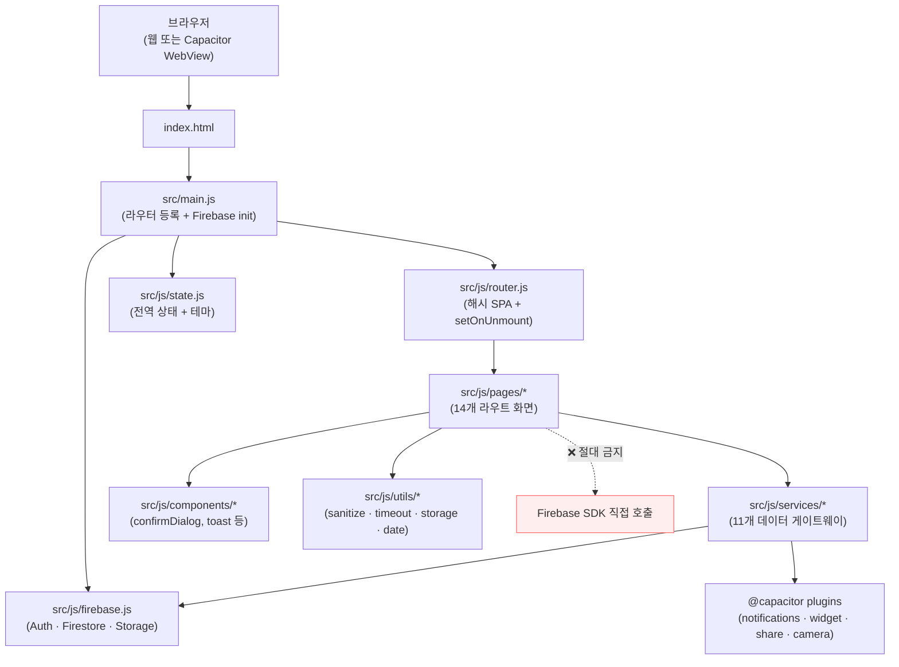
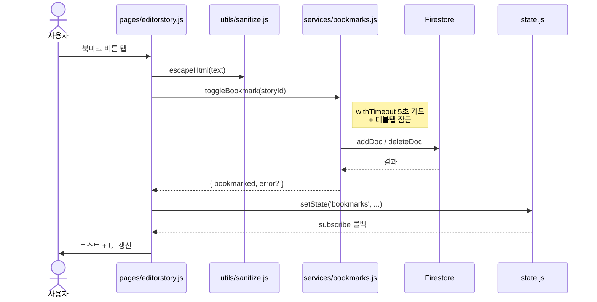

# DayStory 개발자 README

> "오늘 하루의 역사 한 조각" + "내가 쓴 일기" 를 카드로 모아 보여주는 한국어 모바일 앱.
> Apple App Store · Google Play Store 출시 (v1.4.0 작업 중, 직전 출시 v1.3.5).

---

## 한 줄 요약

`html/css/js + Vite + Capacitor + Firebase`. 프레임워크 없이 1666줄짜리 라우터 + 11개 service + 14개 페이지로 구성된 모바일 SPA.

---

## 어디서 뭘 보나

처음 들어왔다면 이 순서로:

1. **이 README** — 전체 그림
2. **[PRD.md](./PRD.md)** — 만들고 있는 게 무엇인지 (1분)
3. **[UI_GUIDE.md](./UI_GUIDE.md)** — 디자인 토큰 + AI 슬롭 금지 목록 (3분)
4. **[SESSION_LOG.md](./SESSION_LOG.md)** 맨 아래부터 — 최근 무슨 작업이 있었는지

조금 더 깊이 들어가야 한다면:

5. **[audit/2026-05-22/](./audit/2026-05-22/)** — 출시 후 첫 종합 감사 결과 + 액션 리스트
6. **[_archive/](./_archive/)** — 옛 정통 SW 문서 (ARCHITECTURE / CODE_MAP / ADR). 빠른 답은 grep으로 충분, 이건 백업.

---

## 아키텍처 한눈에



**핵심 규칙**: 페이지는 **반드시 services를 통해서만** Firestore/Storage에 접근. 직접 import 금지.

---

## 3대 절대 규칙 (CLAUDE.md / AGENTS.md 발췌)

- 🔴 **services 레이어 통과** — Firestore/Storage는 `src/js/services/*` 만. 페이지에서 Firebase SDK 직접 호출 금지.
- 🔴 **sanitize 통과** — 사용자 입력 텍스트는 `src/js/utils/sanitize.js` 의 `escapeHtml()` 후 DOM 삽입. innerHTML 직접 조립 금지.
- 🔴 **setOnUnmount 등록** — 페이지가 `window`/`document`/Capacitor 리스너 달면 `router.setOnUnmount(fn)` 로 정리.
- 🔴 **모달은 confirmDialog** — 브라우저 `confirm()`/`alert()` 금지. `src/js/components/confirmDialog.js` 만.
- 🔴 **CSS 토큰** — 색깔/그림자/반경/z-index는 `src/css/variables.css` 의 `var(--*)`. 하드코딩 금지.

---

## 폴더 지도

```
DayStory/
├── src/
│   ├── main.js                    앱 진입점
│   ├── js/
│   │   ├── router.js              해시 SPA 라우터 + setOnUnmount
│   │   ├── state.js               전역 상태 + 테마 자동 적용
│   │   ├── firebase.js            Auth · Firestore · Storage 초기화
│   │   ├── pages/        (14개)   editorstory, calendar, mystory, detail,
│   │   │                          editor, bookmarks, search, profile,
│   │   │                          settings, login, license, report, about
│   │   ├── services/     (11개)   stories, mystories, bookmarks, images,
│   │   │                          notifications, widget, sharing, camera,
│   │   │                          collection, receivedCards, userCleanup
│   │   ├── components/   (7개)    confirmDialog, toast, settingsSections,
│   │   │                          notificationSettingsSheet, pageHeader,
│   │   │                          editorComment, widgetThemePreview
│   │   ├── utils/        (6개)    sanitize, date, timeout, storage,
│   │   │                          storyI18n, scrollLock
│   │   └── data/                  demo.js (오프라인 폴백 카드)
│   └── css/
│       ├── variables.css          디자인 토큰 (색깔/폰트/간격/z-index)
│       ├── base.css               리셋 + prefers-reduced-motion
│       ├── components.css         재사용 컴포넌트
│       └── pages.css              페이지별 스타일
├── android/                       Capacitor 안드로이드 (위젯 포함)
├── ios/                           Capacitor iOS (Xcode 프로젝트)
├── functions/                     Cloud Functions (공유 OG 메타)
├── tests/                         Vitest UI/유닛 스펙 (24개 spec)
├── firestore.rules                보안 룰 — 클라이언트 admin 부여 차단
├── storage.rules                  Storage 보안 룰 — uid 폴더만, 10MB, image/*
├── capacitor.config.json          앱 ID + 플러그인 설정
└── firebase.json                  Hosting + Cloud Functions + rules 경로
```

---

## 데이터 흐름 (전형적 케이스)



---

## 명령어 치트시트

```bash
npm run dev              # Vite dev 서버 (http://localhost:5173)
npm run build            # 프로덕션 빌드 (dist/)
npm test                 # Vitest 전체 (jsdom)
npx vitest run tests/X   # 특정 spec만
npx cap sync android     # 안드로이드 영향 변경 후 (capacitor.config 수정 시)
firebase deploy --only firestore:rules,storage   # 보안 룰 배포 (변경 시)
```

---

## 출시 상태

- **버전**: v1.3.5 (Android versionCode 20) 출시 / v1.4.0 작업 진행 중
- **앱 ID**: `com.daystory.app`
- **Firebase 프로젝트**: `dokhu-daystory` (env 폴백)
- **iOS / Android 빌드**: 양쪽 완비. RevenueCat npm 의존성은 유지(미연결, 향후 구독용)

### v1.4.0 패치 사이클 (2026-05-22 완료, 미배포)

| Wave | 내용 |
|------|------|
| 1 | donate 페이지 제거 / `window.confirm` → confirmDialog / 알림 기본값 ON |
| 2 | 게스트 모드 완전 제거 → 로그인 강제 |
| 3 | CSS 토큰 보강 + `prefers-reduced-motion` + 터치 영역 44pt |
| 4 | `setOnUnmount` 실제 구현 + 가드들 + Firebase Security Rules |
| 5 | 안전한 리팩토링 (`withTimeout` · `isFirebaseStorageUrl` · `escapeText` 중복 제거) |
| 6 | 카카오톡 공유 SDK 인프라 |

자세한 내용: [audit/2026-05-22/](./audit/2026-05-22/) + [SESSION_LOG.md](./SESSION_LOG.md)

---

## 개인 메모

- **[dokhu.md](./dokhu.md)** — DayStory 시작 이유에 대한 개발자 에세이. 코드와 무관, 마음의 기록.

---

## Harness 자동화 (Claude/Codex 공통)

- `npm run harness:auto` — pending phase 자동 처리
- `npm run harness:status` — phase 목록 확인
- Claude는 `CLAUDE.md`, Codex는 `AGENTS.md`를 읽는다. 둘 다 이 README를 본다.
- 세션 종료 시 `docs/SESSION_LOG.md` append + `scripts/session-checkpoint.sh` 자동 백업
